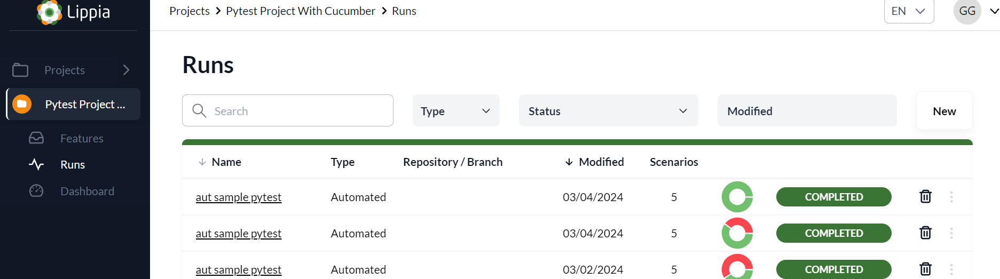

# Lippia Test Manager Pytest-BDD Adapter

[](https://crowdar.com.ar/)  [](https://www.lippia.io/)

The Lippia Test Manager adapter allows to ingest pytest-bdd test results into a Lippia Test Manager instance.  
To have access to a Lippia Test Manager go to  **[Lippia.io](https://lippia.io/)**  website.

## Getting Started

### Import dependency

In order to utilize the LTM reporting library, you first need to set the environment variables with the values for **LTM-User, LTM-Pass, LTM-HostKey, LTM-RepositoryUrl and LTM-RepositoryBranch**. 
Next, you'll need to add the git line to download the dependency in the requirements file with **"git+ssh://git@ssh....../pytest-bdd-7-adapter.git"**. 
Lastly, set the values for the **Project code** and **Run name** variables in the config.py file.


The implementation of the **Lippia Test Manager reporter** requires the use of hooks by implementing the **TestManagerAPIAdapter** class in the **conftest.py** file

``````
git+ssh://git@ssh....../pytest-bdd-7-adapter.git
``````

### Report Class

The TestManagerAPIAdapter class defines a set of methods to interact with the Lippia Test Manager API and record information about Pytest BDD scenarios and steps.
To use the adapter, it is necessary to instantiate the class that implements the TestManagerAPIAdapter interface. This class is responsible for handling Pytest BDD hooks, which are special functions that are executed at different points during scenario execution. Hooks must be independent functions defined at the module level to be accessible from anywhere.
In this way, the TestManagerAPIAdapter adapter allows for the recording of information about Pytest BDD scenarios and steps in Lippia Test Manager, facilitating the tracking and management of tests.

When running the tests, the hooks in the conftest file will automatically execute, injecting the generated report into LTM. 

  
  

### Configure the env variables

| Key                        | Concept                                                                 | Is         |  
|----------------------------|-------------------------------------------------------------------------|------------|  
| TEST_MANAGER_USER_KEY      | User with which the Test Manager instance will be authenticated         | Mandatory  |  
| TEST_MANAGER_PASS_KEY      | Password with which the Test Manager instance will be authenticated     | Mandatory  |  
| TEST_MANAGER_API_HOST_KEY      | Host to which the adapter will attempt to authenticate                  | Mandatory  |  
| TEST_MANAGER_API_PORT_KEY      | Port on which the Test Manager instance will be listening               | Optional   |  
| TEST_MANAGER_REPOSITORY_URL      | URL of the repository linked to the project                | Mandatory   |  
| TEST_MANAGER_REPOSITORY_BRANCH      | Branch from where the automated tests are being injected                 | Mandatory   |  

**Local variables in the config file**

| Key                        | Concept                                                                 | Is         |  
|----------------------------|-------------------------------------------------------------------------|------------|
| RUN_NAME      | Run name, serves as identifier of the suite execution                   | Mandatory  |  
| PROJECT_CODE  | Project Code into which the adapter will attempt to inject test results | Mandatory  |
